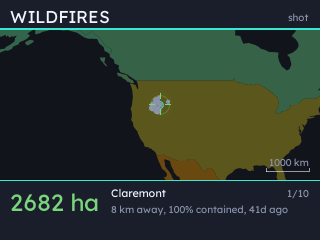
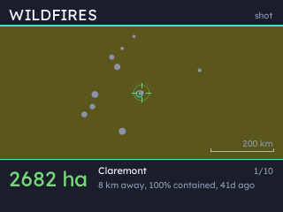
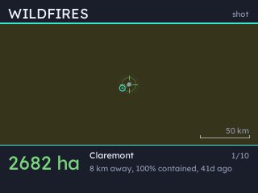
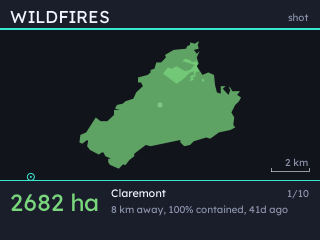
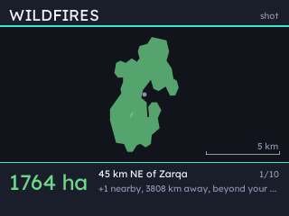

# statsbadge-wildfires

Wildfire perimeters near a chosen location, plotted on a map, for [statsbadge](https://github.com/pimoroni/statsbadge).

The intention of this plugin was to focus on anomalous local events, but currently separating that data
out from regular, global wildfires is difficult. Range is offered as a proxy for "significant local fires"
but many fires (in the UK, in particular), are not significant enough on the global scale to be included.

Nonetheless from a local perspective these wildfires are devastating and, as with any other extreme weather
related mishaps, we comfy, naive British are not well equipped to deal with them.

This plugin wont tell you that Minsmere's heathland needs your help. But I will:

* [National Trust Appeal for Dunwich Heath](https://www.nationaltrust.org.uk/support-us/appeals/dunwich-heath)
* [RSPB Minsmere Appeal](https://www.rspb.org.uk/donate/minsmere)

**This plugin is very much a work in progress until a local, climate-change driven feed can be curated.**

    

The badge cycles through wildfire events within a configurable radius of your chosen location. It moves
between fires by zooming out until a continent is on screen (for context), traversing the globe
with a cursor on the target, then closing in. Wildfires are drawn as their affected area with a scale bar below.

Under the map details how big, how far away, how contained and how long ago the wildfire was.

Perimeters come from [WFIGS](https://data-nifc.opendata.arcgis.com/) for the United States and
[Copernicus GWIS](https://gwis.jrc.ec.europa.eu/) for Europe, Africa and western Asia.

No API key or account needed.

## Install

Install the wildfires extension from the statsbadge extensions UI, easy.

If you're running on a CLI you can also:

```bash
statsbadge ext add wildfires
statsbadge install
```

Then add a **Wildfires** page in the config UI. It needs a location and will use your configured
one by default.

## Settings

| Setting | What it does |
| ------- | ------------ |
| Smallest fire | Below about 100 hectares the feeds fill up with wildfires that were out before anyone noticed them |
| How many | How many fires the map cycles through, nearest first |
| Merge fires within | One incident is often several perimeters a few kilometres apart. The closest in a cluster stands in for the group. Zero shows individial fires. |

Per page:

| Setting | What it does |
| ------- | ------------ |
| Within | How far from the location to look. Wide enough to find something, narrow enough that it finds something relevant nearby |
| Each fire | How long the map shows an incident before panning to the next |
| Place, Latitude, Longitude | Overrides the badge's default location, so one badge can watch two or more places |

## Why does it need a location?

Ranked globally, the largest fires on Earth are Sahel grassland burns, month in and month out,
with a scatter of false positives over the Southern Ocean. That is a real answer to "what is
the biggest fire" but not a very relevant indicator for local, anomalous fire incidents.

A radius helps narrow down the search to local events, though the map will fall-back to distant
fires if there are none local. In the UK it's particularly tricky because fires are extremely
rare and thus extremely notable and devastating. On a global scale they're a blip, lasting a
fraction of the time, or coming in at a fraction of the size of seasonal burns. Filtering for
unusual events is tricky because the data makes no distinction.

## Coverage

| Region | Perimeters |
| ------ | ---------- |
| United States | WFIGS |
| Europe, Africa, western Asia | GWIS |
| Australia, East Asia | **none yet** |

**There is no perimeter feed here for Australia or East Asia**, if you set your
location somewhere in these regions you'll see nothing in range.

A fire is modelled as a point with a size and *optionally* an outline, so a hotspot
feed can fill the same slot later without the page changing.

GWIS maps burnt area rather than incidents, so its fires arrive with no incident name and are
named after the nearest town instead. Its smallest mapped fire is a few hundred hectares, which
is above most UK heath fires: a page set to the UK will usually find nothing local.

## Notes

Where nothing is in range the nearest events are shown instead, marked as beyond your configured radius.
There's a strong conflict between "nothing to show" and "cutting to the really important local events"
and currently I don't think there's a feed that gives me what I want- anomalous, climage-change
driven local fires.

Wildfire incidents are plotted as outlines rather than single points. The shape and size of the
fire is meaningful, but also impossibly small on the global scale to plot on a zoomed-out map.

As such the map zooms *right in* to an incident and shows the outline against a scale.

Currently the twenty largest WFIGS fires total 15MB of GeoJSON across 426,000 points. This can be
cut down by generalising the feeds server-side. The data is further cut down and simplified against
the resolution it will be drawn at (very smol on a 320x240 pixel display). Ten fires with outlines
is about 9KB.

The feeds are polled every fifteen minutes and the badge polls every second, so the set travels
only on a change.
